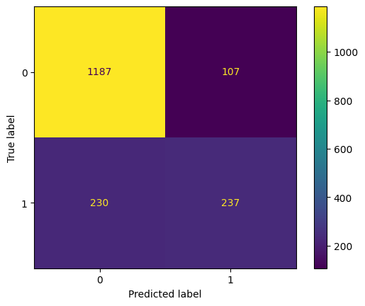

# Churn-predictions
# Probability of Churn Prediction with XGBClassifier

## Project Overview
This project aims to predict the probability of clients of a telecom company to churn (cancel the service).
## Results
The model has a **roc_auc_score** of 0.843 but further hyperparameter tuning and validation methods may be applied in the future.




## Methodology

### 1. Data Cleaning & Preprocessing
* Redundant data and non-formatted data were properly dealt with as needed.
* Churn was transformed to binary.
* **SimpleImputer** was used for numerical data (e.g. tenure).
* **OneHotEncoder** was used for low cardinality categorical data (e.g. PaymentMethod).
* **OrdinalEncoder** was used for high cardinality categorical data and binary data (e.g. gender).

### 2. Model Configuration
* **early_stopping_rounds** was used to prevent the overfitting of **n_estimators=2000**.
* **max_depth=5** constrained the tree depth to control model complexity.
* **learning_rate=0.05** was used to achieve better accuracy.

## How to Run
1. **Clone this repository**
   ```bash
   git clone https://github.com/hvbridi/Churn-predictions.git
   cd Churn-predictions
   ```
2. **Install dependencies**:
    ```bash
    pip install -r requirements.txt
    ```
3. **Run the Notebook**:
    Open churn_prediction.ipynb in Jupyter Notebook, JupyterLab, or VS Code and run all cells.

---
*Developed by Henrique Varnier Bridi*